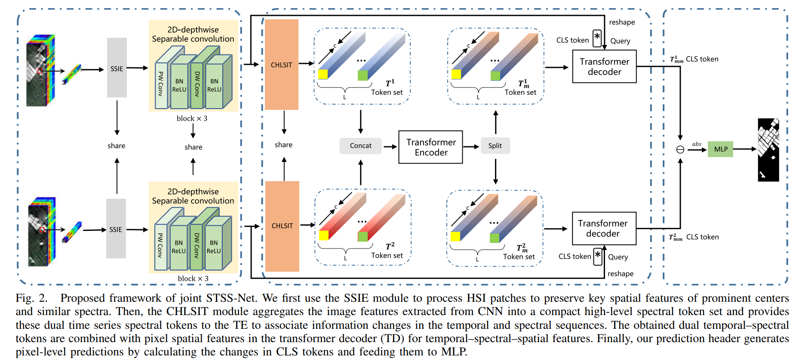
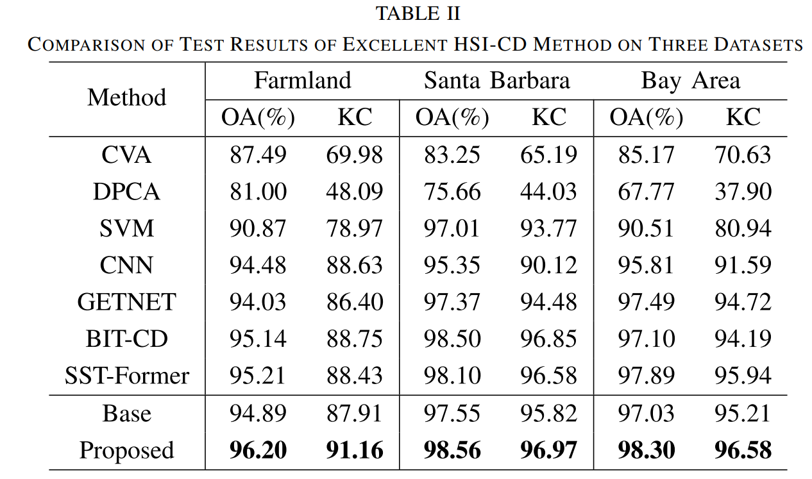
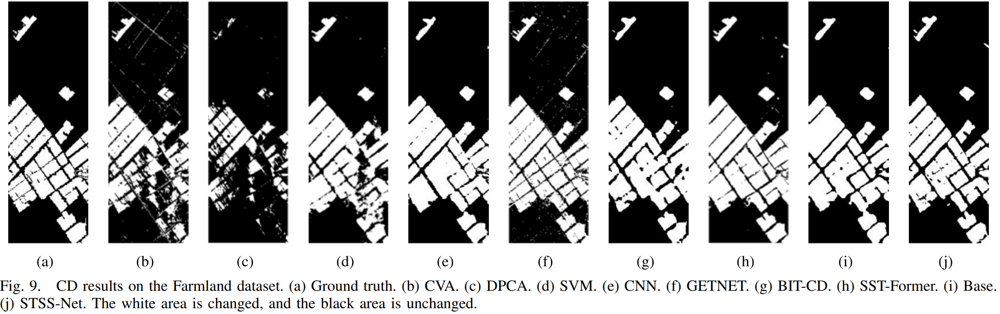
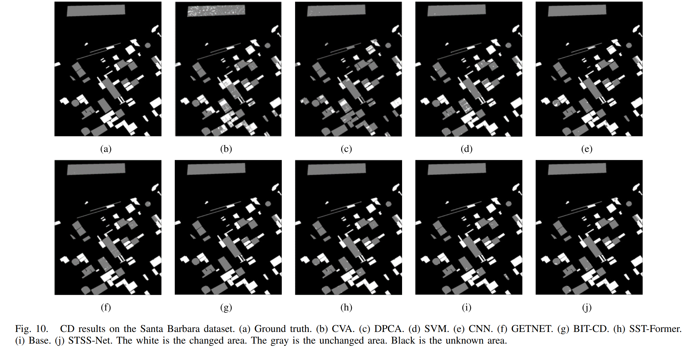
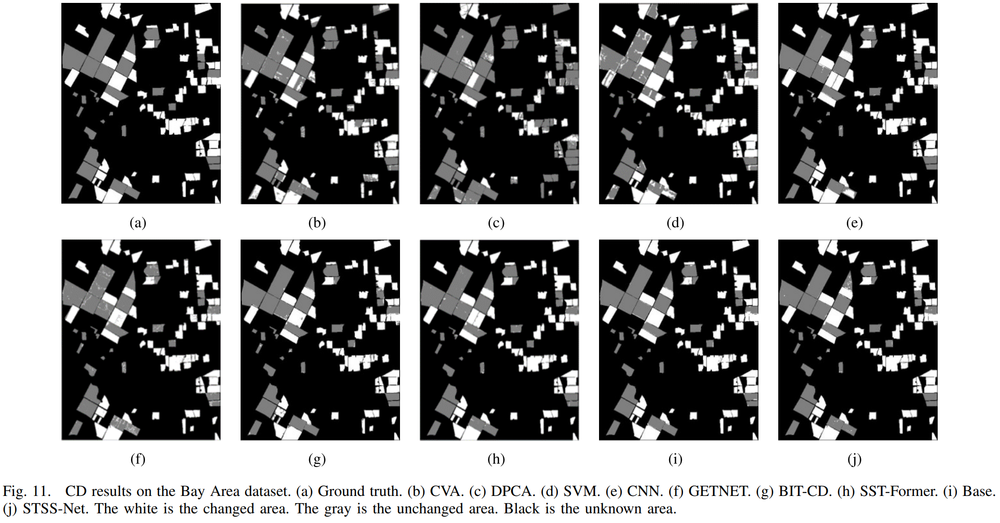

# 论文题目：A Joint Saliency Temporal–Spatial–Spectral Information Network for Hyperspectral Image Change Detection
* 论文地址：https://ieeexplore.ieee.org/abstract/document/10365188
* 项目地址：https://github.com/WUTCM-Lab/STSS-Net

## 摘要
高光谱图像变化检测（HSI-CD）是遥感观测领域中的一项基础任务，它利用双时相高光谱图像中丰富的光谱和空间信息，来检测地球表面的微小变化。然而，现有基于深度学习的HSI-CD方法多依赖于基于图像块的处理方式，这种方式容易在有限的接收域内引入光谱带冗余和空间信息噪声，从而忽视了显著性信息的提取与利用，限制了变化检测性能的提升。为了解决上述问题，本文提出了一种用于HSI-CD的联合显著性时-空-谱信息网络（STSS-Net）。本研究的主要贡献可以总结如下：
1）我们设计了一个空间显著性信息提取模块（SSIE），基于中心像素的距离与物质的光谱相似性进行去噪，增强了对相似光谱物质间空间差异和不同光谱物质间空间差异的关注；
2）我们设计了一个紧凑的高层次光谱信息编码器（CHLSIT），用于提取光谱显著性信息，能够通过光谱波段的非线性组合表达感兴趣变化的高层语义信息，并通过提取高层次的光谱概念特征来消除冗余；
3）我们结合了CNN与Transformer架构的优势，实现了时-空-谱信息的联合建模。
在三个真实的HSI-CD数据集上的实验结果表明，STSS-Net能够有效提升变化检测的准确性，并在边缘信息和复杂信息的检测方面具有一定优势。

## Part.01 研究贡献

1. 我们提出了一种**联合显著性时-空-谱信息网络（STSS-Net）**。该网络结合了时间、光谱和空间的特征信息，并通过三个关键模块提取与变化检测相关的显著性信息：一个用于提取空间显著性特征的卷积神经网络、一个用于去除光谱冗余的Transformer架构，以及一个预测头。
2. 我们设计了一个**空间显著性信息提取模块（SSIE）**，用于去噪以增强空间显著性。该模块基于像素间的距离和光谱相似性，通过扩展有限的图像块大小，并选择最合适的局部-全局信息提取策略，从而提升对全局信息的提取能力。
3. 我们设计了一个**紧凑高层次光谱信息编码器（CHLSIT）**，通过提取高层次的光谱概念特征来消除冗余，从而提升光谱信息的显著性。光谱变化中感兴趣区域的高层语义信息可由多个光谱波段的非线性组合表示，并结合邻域光谱信息，使得光谱信息更为紧凑。此外，该模块还基于高层次光谱概念token对光谱序列和时间上下文进行建模。

## Part.02 模型结构
STSS-Net的整体流程如图2所示。
1. SSIE模块，用于增强空间信息的显著性；
2. CHLSIT模块，用于学习光谱之间的关系，并为每个时间输入生成一组紧凑的高层次光谱tokens，这些tokens结合了邻域信息；
3. CNN、Transformer编码器和解码器，分别提取图像块的空间、时间和光谱信息。最终，在解码阶段将显著性空间特征与双时相的高层光谱token集进行融合。

## Part.03 数据集

1. [Farmland 数据集](https://rslab.ut.ac.ir/data)：该数据集中的双时相高光谱图像分别采集于2006年和2007年。每幅图像的尺寸为420 × 140像素，覆盖了中国江苏省盐城市部分耕地的变化区域。经过预处理后，图像共包含155个光谱波段。该数据集中包含40,417个未变化像素样本和18,383个变化像素样本。

2. [Santa Barbara 数据集](https://citius.usc.es/investigacion/datasets/hyperspectral-change-detection-dataset)：我们使用的 Santa Barbara 数据集中的双时相高光谱图像分别由 AVIRIS 传感器于2013年和2014年采集，用于捕捉美国加利福尼亚州圣塔芭芭拉地区的局部变化区域。每幅高光谱图像尺寸为984 × 740像素，其中包含80,418个未变化像素样本、52,134个变化像素样本，以及595,608个状态未知的像素样本。经过预处理后，该数据集的图像共包含255个光谱波段。

3. [Bay Area 数据集](https://citius.usc.es/investigacion/datasets/hyperspectral-change-detection-dataset)：该数据集中的双时相高光谱图像同样由 AVIRIS 传感器于2013年和2014年采集，用于捕捉美国加利福尼亚州帕特森地区的变化像素。每幅高光谱图像尺寸为600 × 500像素，包含34,211个未变化像素样本、38,425个变化像素样本，以及227,364个状态未知的像素样本。经过预处理后，图像共包含255个光谱波段。

## Part.04 实验结果
### 定量实验
在相同设置下，在三个数据集上与其他方法进行了比较。然而，由于部分论文未公开代码和参数，因此本文未对这些方法的相关指标进行分析。我们仅保留了一些具有可比性的对比方法。如表1所示，这些结果证明了本文的检测方法的有效性。
#### 
表1 不同方法在三个数据集上的性能比较

### 定性实验
图 7 至图 9 分别展示了这三个数据集的变化检测可视化对比结果。

## Part.05 研究展望
我们在一个小规模的训练数据集上进行了实验，结果表明 STSS-Net 在三个数据集上均达到了当前最先进的性能，并验证了其在边缘和复杂信息检测能力方面的提升，以及 SSIE 模块在基于图像块方法中的稳定性、局部信息扩展能力与准确性的改进。
然而，我们提出的网络在性能上很大程度依赖于超参数的最优设置。不同数据集通常对应不同的超参数设置，这不利于将该模型扩展到由不同传感器获取的其他 HSI-CD 数据集。

我们未来的工作将聚焦于以下几个方面：
第一，我们将通过自适应学习方法更有效地融合两类注意力信息；
第二，我们将探索更高效、简洁的方式来解耦光谱信息，直观表达相同或不同的高层光谱概念信息；
第三，我们计划通过无监督方法和迁移学习生成光谱信息，以缓解数据集不足带来的影响。